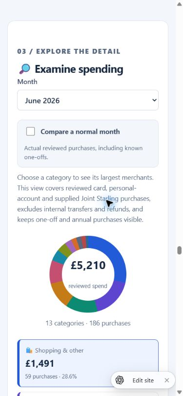
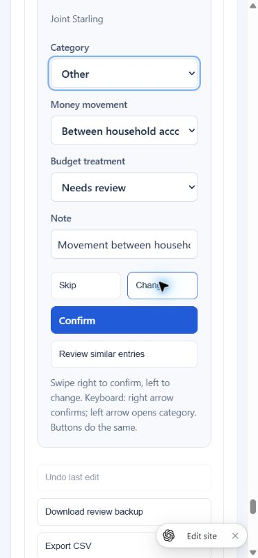
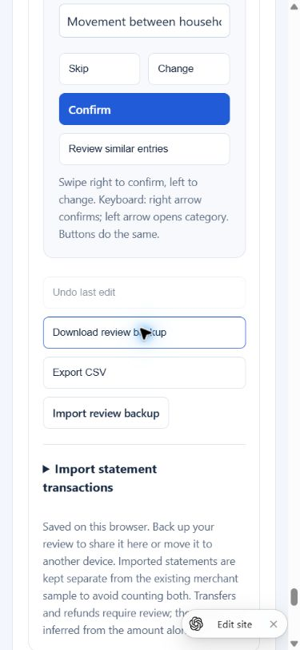

# Mobile review — 3 October 2026

Reviewed the owner-private live Home Move Planner at 390 × 844 in Chrome. The monthly savings scorecard is present in version 21. No financial classifications were changed during this review.

1. Entry — needs improvement. Examine spending lands on charts and merchant breakdowns before the transaction review. A direct Review transactions navigation entry would reduce scrolling.
   
2. Categorisation — usable with friction. Cards expose category, money movement, budget treatment and notes, with an explicit Confirm button. Long selected values are visibly truncated and the merchant/amount can be above the viewport when actions are visible. Keep transaction identity and actions visible; simplify advanced fields. Swipe and actual-device touch behaviour need separate testing.
   
3. Return decisions — manual handoff available, download completion unverified. Download review backup is present; current source exports JSON containing records, statement metadata and savings plan. A browser download-event check timed out, so this audit does not confirm a saved download file. Export CSV omits the richer statement and savings-plan metadata. The on-screen save notice correctly says reviews stay in this browser.
   

Current workflow: supply statements in Codex; extract and reconcile dated rows; update the private published site; categorise on the phone; download the JSON review backup and attach it in Codex for merging and republishing. Source-repository access does not expose phone browser storage. Current Sites database overview has no tables or bindings, so automatic shared review state requires implementation.

Priority improvements: dedicated review entry; card and action layout that fits a phone; prominent JSON export/share; private shared storage if automatic cross-device access is desired.

Evidence limits: responsive Chrome viewport, not a physical phone. No screen-reader, real touch, category commit, backup restore, or successful downloaded-file checks were completed. Screenshots alone do not prove accessibility compliance.
